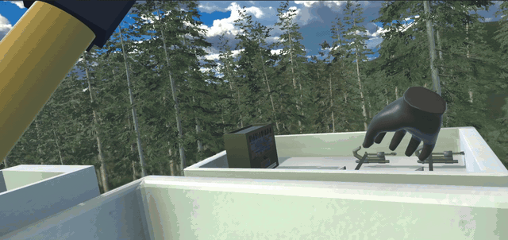

# VR Safety-Training Simulation for Power-Line Workers

A Meta Quest VR simulation that turns traditional electric-lineworker safety
instruction into a hands-on task with performance scoring, built by a four-person
Texas A&M capstone team in partnership with TEEX (Texas A&M Engineering Extension
Service), Jan–May 2023.

You drive a bucket truck's boom up to a de-energized distribution pole, verify every
line is actually dead using a power meter on an extendable shotgun stick, and attach
grounding clamps to the neutral lines in the prescribed safety order. At the end of
the run you get a report covering time, tool drops, and any safety infractions, such
as clamping before checking, clamping out of order, or working outside the designated
zone.

## Highlights

- **Two-handed shotgun-stick interaction**: an `XRGrabInteractable` subclass with a
  two-hand rotation solve and a midgrab-to-far-grab reach extension, so the pole
  handles like the real tool.
  [`TwoHandGrabInteractable.cs`](Assets/Scripts/ShotgunRod/TwoHandGrabInteractable.cs)
- **Socket-based clamp & power-check system**: each line is a smart socket that
  registers power-meter checks and snaps clamp hooks into place.
  [`PowerLines.cs`](Assets/Scripts/ShotgunRod/PowerLines.cs)
- **Runtime-drawn neutral lines**: line geometry follows the clamp hooks as they're
  carried and placed. [`RenderLine.cs`](Assets/Scripts/ShotgunRod/RenderLine.cs)
- **Infraction & scoring engine**: an event-order referee that enforces
  check-before-clamp and correct clamp sequence, then generates the end-of-run
  report. [`Tracker.cs`](Assets/Scripts/Tracker.cs)
- **Experiment panel flow**: scenario selection driving an 8-condition
  human-subjects experiment. [`PanelManager.cs`](Assets/Scripts/PanelManager.cs)

**[Read the technical deep dive →](TECHNIQUE.md)**

## Try it on Quest

Grab `ElectricLineWorker.apk` from the
[v1.0 release](../../releases/tag/v1.0) and sideload it onto a Quest 2 (via
[SideQuest](https://sidequestvr.com/) or `adb install`).

Setup for best results:

1. Turn Meta Guardian on and set your floor height properly.
2. Turn Guardian off so it doesn't interfere with the bucket ride.
3. Stand and play.

## The experiment

The simulation doubles as a human-subjects study on instruction modalities in VR
training. The in-game scenario panel selects among four conditions (Instructions +
Highlights, Instructions only, Highlights only, or Neither) crossed with two
environments: Environment 1 adds bucket sway, ground blur, wind, and ambient audio,
while Environment 2 has none. Details and results are in the
[final research paper](docs/Final%20Research%20Paper.pdf).

## Built with

- Unity 2021.3.18f1 (URP)
- XR Interaction Toolkit 2.2.0
- Oculus XR Plugin 3.3.0
- Meta Quest 2

This repo is a curated republication of a private team repository: the C# gameplay
source (verbatim as shipped in May 2023), documentation, and build. The full Unity
project is not included because its third-party assets can't be redistributed.

## Team & credits

Four-person team for VIST 477 (Virtual Reality) at Texas A&M, spring 2023, taught by
Dr. Edgar J. Rojas-Muñoz; built in partnership with TEEX:

- **Peter Castelein**: player-interaction layer, meaning the shotgun stick,
  clamp/power-check sockets, and runtime lines (`Assets/Scripts/ShotgunRod/`), the
  infraction/scoring engine (`Tracker.cs`), instruction copy and experiment-flow
  edits, and the Quest builds.
- **Robin Schniebel**: bucket and truck controls, experiment panels, highlight
  system, sound, environment assembly.
- **Sarah Luster**: environment art.
- **Soha Aftab**: assets.

A per-file authorship table (from the original repo's git history) is in
[TECHNIQUE.md](TECHNIQUE.md#authorship). Teammates agreed to portfolio use; shared for
portfolio review, not licensed for reuse.
